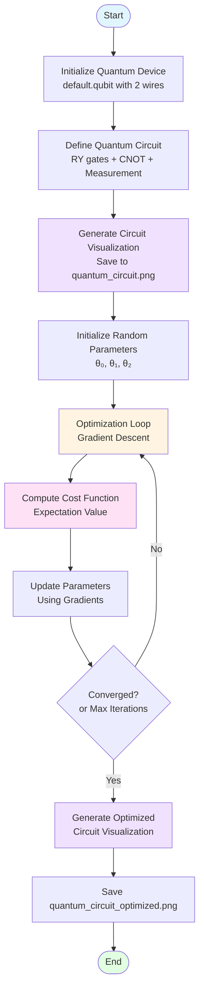

# PennyLane Quantum Computing Project

A beginner-friendly PennyLane project demonstrating basic quantum circuit operations and optimization.

## What is PennyLane?

PennyLane is a Python library for quantum machine learning, quantum computing, and quantum chemistry. It provides a unified interface to work with quantum simulators and real quantum hardware.

## Do I Need a PennyLane API Key?

**For this project: NO API key is required!**

This project uses `default.qubit`, which is a local quantum simulator that runs entirely on your machine. No cloud access or API keys are needed.

**When would you need an API key?**
- If you want to use cloud-based quantum devices (like IBM Quantum, Google Quantum AI, Amazon Braket, etc.)
- If you want to access real quantum hardware through PennyLane Cloud
- You can get API keys from the respective quantum cloud providers if you want to explore real hardware later

## Project Structure

```
pennylane/
├── main.py              # Main quantum circuit code
├── requirements.txt     # Python dependencies
├── Dockerfile          # Docker configuration
├── .dockerignore       # Files to exclude from Docker build
└── README.md           # This file
```

## Running Locally (Without Docker)

1. **Install Python dependencies:**
   ```bash
   pip install -r requirements.txt
   ```

2. **Run the project:**
   ```bash
   python main.py
   ```

## Running with Docker

### Prerequisites
- Docker installed on your system
- Docker daemon running

### Build the Docker image:
```bash
docker build -t pennylane-project .
```

### Run the container:
```bash
docker run pennylane-project
```

### Run with volume mount (to access visualization files):
```bash
docker run -v ${PWD}/output:/app/output pennylane-project
```
This will save the visualization PNG files to the `output` directory on your host machine.

### Run interactively (for development):
```bash
docker run -it -v ${PWD}:/app pennylane-project bash
```

## What This Project Does

This project demonstrates:
1. **Quantum Circuit Creation**: Creates a simple variational quantum circuit with rotation gates and entanglement
2. **Circuit Visualization**: Shows the structure of the quantum circuit both as text and as visual PNG files
3. **Parameter Optimization**: Uses gradient descent to optimize quantum circuit parameters
4. **Expectation Values**: Measures quantum observables (Pauli-Z operator)
5. **Output Files**: Generates visualization images saved to the `output` directory:
   - `quantum_circuit.png` - Initial circuit visualization
   - `quantum_circuit_optimized.png` - Circuit with optimized parameters

## Project Visualization

### Quantum Circuit Structure

The following diagram shows the structure of our variational quantum circuit:

```mermaid
graph LR
    subgraph "Qubit 0"
        Q0[|0⟩] --> RY1[RY(θ₀)]
        RY1 --> CNOT1[●]
        CNOT1 --> RY3[RY(θ₂)]
        RY3 --> M1[Measure Z]
    end
    
    subgraph "Qubit 1"
        Q1[|0⟩] --> RY2[RY(θ₁)]
        RY2 --> CNOT2[X]
        CNOT2 --> M2[Output]
    end
    
    CNOT1 -.-> CNOT2
    
    style Q0 fill:#e1f5ff
    style Q1 fill:#e1f5ff
    style RY1 fill:#fff4e1
    style RY2 fill:#fff4e1
    style RY3 fill:#fff4e1
    style CNOT1 fill:#ffe1f5
    style CNOT2 fill:#ffe1f5
    style M1 fill:#e1ffe1
```

**Circuit Explanation:**
- **Initialization**: Both qubits start in the |0⟩ state
- **RY Gates**: Rotation gates around the Y-axis with parameters θ₀, θ₁, and θ₂
- **CNOT Gate**: Creates entanglement between qubits (control on qubit 0, target on qubit 1)
- **Measurement**: Measures the expectation value of Pauli-Z operator on qubit 0

### Project Workflow



## Learning Resources

- [PennyLane Documentation](https://docs.pennylane.ai/)
- [PennyLane Tutorials](https://pennylane.ai/qml/)
- [Quantum Computing Basics](https://pennylane.ai/qml/basics.html)

## Next Steps

Once you're comfortable with this example, you can:
- Modify the circuit structure
- Try different optimizers
- Experiment with more qubits
- Connect to real quantum hardware (requires API keys)
- Explore quantum machine learning applications

## Troubleshooting

**Issue**: `ModuleNotFoundError: No module named 'pennylane'`
- **Solution**: Make sure you've installed dependencies: `pip install -r requirements.txt`

**Issue**: Docker build fails
- **Solution**: Ensure Docker is running and you have internet connectivity

**Issue**: Want to use real quantum hardware
- **Solution**: Sign up for a quantum cloud provider (IBM Quantum, Google Quantum AI, etc.) and configure PennyLane with your API credentials

## License

This is a learning project. Feel free to modify and experiment!
